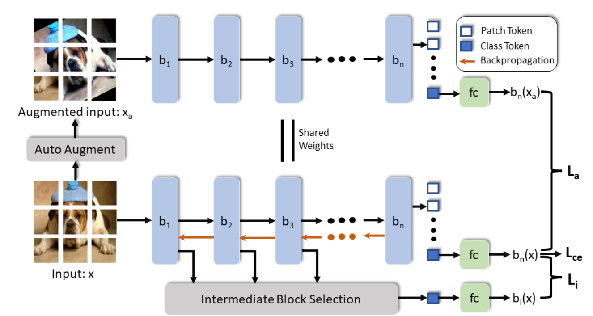

## :fire: Robust Representation Learning with Self-Distillation for Domain Generalization :fire:
**Date: 2023-02-19** [:link:](https://arxiv.org/abs/2302.06874)
#tag/computer_vision #tag/self-distillation
### Key idea 
utilize self-distillation to learn domain-invariant features to improve domain generalization. It is claimed to be the first few work on ViT

#### key design:

- feed origional image x to NN to get logit output $p(f(x'))$
- apply data augmentation to image x to get image x'
- calculate all intermiediate feature output and feed them to a fc layer f' to get logit $p(f'(x'))$
- calculate the KL divergence $L(p(f(x))||p(f'(x))) as L_i$
- calculate the KL divergence $L(p(f(x))||p(f'(x'))) as L_a$
- the final loss is a compose of $L = L_ce + \lambda L_i + \gamma L_a$
### Takeway 

- self-distillation can be combined with data augmentation to achieve better robustness
- tools: AutoAugment: [:books:](https://arxiv.org/pdf/1805.09501.pdf) [:hammer:](https://pytorch.org/vision/main/generated/torchvision.transforms.AutoAugment.html)

### Idea 
- Is there any more quantitive way of measure domain generalization and directly optimize it?
- For domain adaption where we have access to the target domain data, how can we achive better performance?
  - a possible solution would be that we can disentangle the domain invariant and sepecific features. For example, we can adopt the two-encoder structure to learn features separately and try to maximize the correlation of invariant features (probbaly more accurate if model the conditional probability) and minimize the correlation of invariant and specific features.

___
___

## :fire: Revisiting Self-Distillation :fire:
**Date: 2023-02-19** [:link:](https://arxiv.org/abs/2206.08491)
#tag/computer_vision #tag/self-distillation
### Key idea
This paper shows that 1) in self-distillation(both teacher and student model share the same model archicture) student model can always surpass teacher model 2) existing theoretical explation of self-distillation is problematic 3) the success of self-distillation can be explained by the loss landscape geometry

:thumbsup: the analysis is multi-facet: they first compare ensemble 

:thumbsdown: Their evidence of disprove multi-view theory is not very convincing. When the author proves that multi-view theory cannot explain that when increasing the self-distillation round, the student's model performance does not increase accordingly. This can be possible that the model lack of capacity to learn all the features. If same finding can be shown on large model, it would be more sound. There are also many results that have little discussion, for example, why self-distillation outperform SAM model. Discussion on Figure 8 about the round 2 loss surface coutour.

### Takeway
- ensemble model perform better than Born-again Neural Networks(BAN). When performing multi-round self-distillation, the gain graduately vanished.
- PyHessian [:hammer:](https://github.com/amirgholami/PyHessian)
- Sharpness-Aware Minimization (SAM) 
[:books:](https://arxiv.org/pdf/2010.01412.pdf) 
[:hammer:](https://github.com/google-research/sam)
- visualize loss contour [:hammer:](https://mathformachines.com/posts/visualizing-the-loss-landscape/)

### Idea
- Some evidence shows that ensemble model always surpass self-distill model (although there is always gains from making the model more compact). Any support for that?
- Since performing multi-round distillation the gain can vanish. Is there any good way of doing early stopping?

