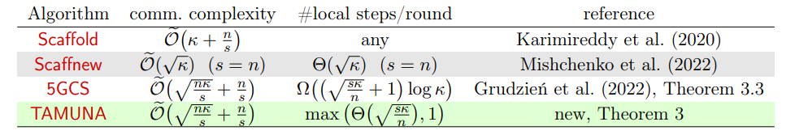

## :fire: Explicit and Implicit Knowledge Distillation via Unlabeled Data :fire:
**Date: 2023-02-20** [:link:](https://arxiv.org/abs/2302.08771) #tag/computer_vision #tag/knowledge-distillation
### Key idea
this paper proposed a knowledge distillation method that consider prediction entropy as a method for selecting subsitute dataset from wild (a vein of knowledge distillation method that make use of unlabeld public dataset). Major components compose of: 1) a adaptive threshold selection. Use entropy as a way to select samples from a dataset. 2) class-dropping noise suppresion. Use confidence to generate pseudo labels (multi-label). 3) feature distillation component. pick two layers in NN, one from the firt BN layer which represent low level features (claimed to boost the convergence speed), the other from the last layer before final linear layer which is used to mimic the output of the teacher model. 4) last is structure differentiation relationships which constrain the difference of the output logits of teacher and student should be close.

:thumbsup: The design of multiple component to suppress either the label noise or imitate the structured differentiation is interesting.

:thumbsdown: There are no much novelty here. More or less like putting pices together to get a dish. 

### Takeway

### Idea

- feature distillation part is too loose. Is there any better way to improve the convergence?
- the final loss term is too many. Which is the most foundimental component lead to such performance boost.
- what if the origional model is not robust, can student model inherite them?

___
___

## :fire: TAMUNA: Accelerated Federated Learning with Local Training and Partial Participation :fire:
**Date: 2023-02-20** [:link:](https://arxiv.org/abs/2302.09832) #tag/federated_learning
### Key idea
This paper proposed a novel federated learning algorithm to reduce communication complexity. The method is a "PP" version of Scaffnew.
  
:thumbsup: A compreshnsive review of past work and convey the idea very clearly.

:thumbsdown: Simulate on a sythetic dataset. Experiment is too thin.

### Takeway
- several FL algorithms
    - **scallfold** is proposed to correct fedavg under no-iid setting with linear converge speed, similar in **S-Local-GD** and **FedLin**. However, their communication complexity is $O(klog\epsilon^{-1})$
    - **Scaffnew** is proposed to improve the communication efficiency with improved complexity of $O(\sqrt{k}log\epsilon^{-1})$. Similarly for **APDA-Inexact** and **5GCS**

### Idea
- probabaly better to refer to Scaffnew paper to get more idea...

___